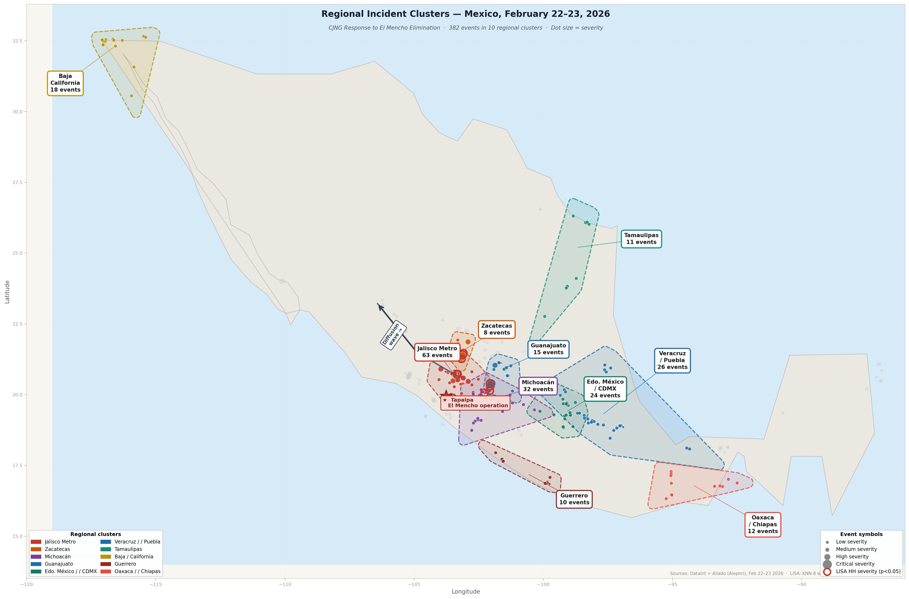
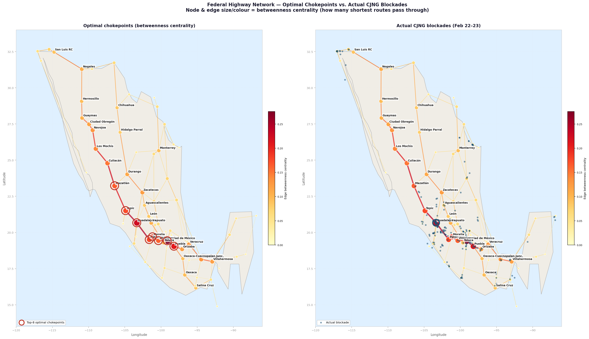
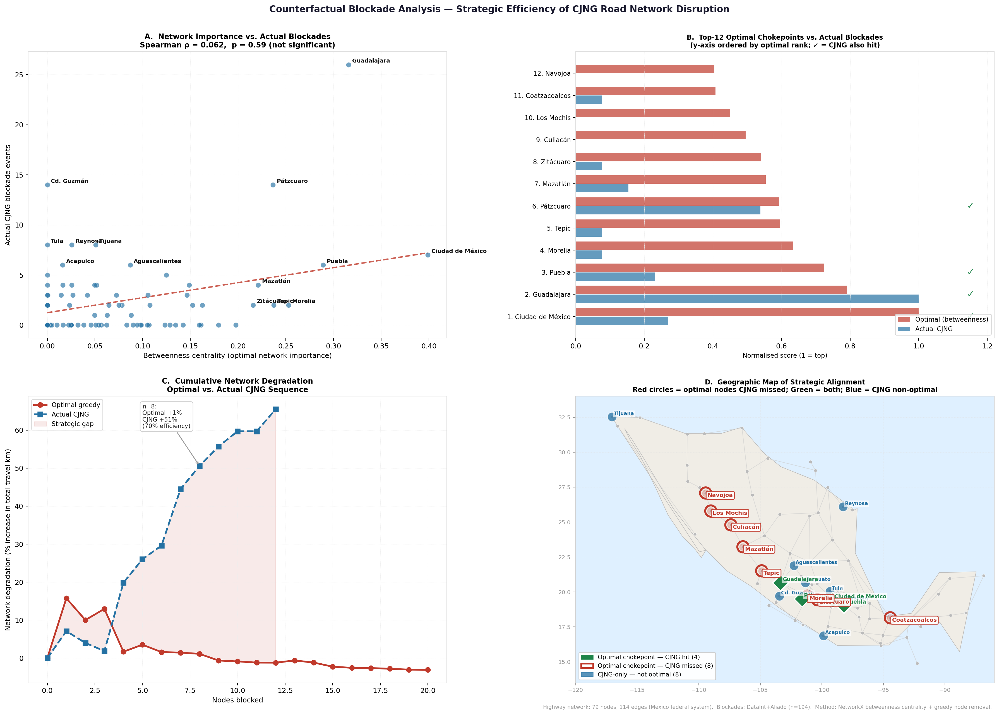

# Mexico Security Incident Analysis — February 22–23, 2026

**Combined DataInt + Aliado Dataset &nbsp;|&nbsp; 389 incidents &nbsp;|&nbsp; 25 states**  
*Duplicate cross-source detection applied (1 km / 2-hour threshold)*

> **KEY FINDING:** The overwhelming majority of incidents on February 22–23, 2026 were a direct reaction to the killing of Nemesio Oseguera Cervantes ("El Mencho"), leader of the Jalisco New Generation Cartel (CJNG), during a federal security operation. Violence cascaded across at least 25 states within hours of the news, following a clear pattern: blockades and vehicle fires on highways, followed by attacks on commercial and financial installations in urban areas.

---

## Table of Contents

1. [Dataset Overview](#1-dataset-overview)
2. [Distribution of Event Types](#2-distribution-of-event-types)
3. [Spatial Distribution, Regional Clusters, and Road Network Strategy](#3-spatial-distribution-regional-clusters-and-road-network-strategy)
   - [3.1 Primary Clusters](#31-primary-clusters)
   - [3.2 Road Network Chokepoints: Optimal vs. Actual](#32-road-network-chokepoints-optimal-vs-actual)
   - [3.3 Regional Blockade Doctrines: Three Distinct Strategies](#33-regional-blockade-doctrines-three-distinct-strategies)
   - [3.4 Temporal Pattern](#34-temporal-pattern)
4. [Highway Corridors vs. Urban Areas](#4-highway-corridors-vs-urban-areas)
5. [Target Installation Analysis](#5-target-installation-analysis)
6. [High-Severity Incidents](#6-high-severity-incidents-severity-34)
7. [Cross-Source Analysis: DataInt vs. Aliado](#7-cross-source-analysis-dataint-vs-aliado)
8. [Guardia Nacional Casualties](#8-guardia-nacional-casualties)
9. [Conclusions](#9-conclusions)
- [Appendix A: Spatial Statistics Summary](#appendix-a-spatial-statistics-summary)
- [Appendix B: Road Network Disruption — Counterfactual Analysis](#appendix-b-road-network-disruption--counterfactual-analysis)
- [Appendix C: Methodology and AI-Assisted Process Note](#appendix-c-methodology-and-ai-assisted-process-note)

---

## 1. Dataset Overview

This report synthesizes incident data from two independent platforms — **DataInt** and **Aliado (Alephri)** — covering the period from February 22 (08:00 CST) to February 23, 2026 (08:00 CST). A total of **389 records** were collected, of which **32 records (16 pairs)** were flagged as likely cross-source duplicates based on geographic proximity (within 1 km) and temporal overlap (within 2 hours).

| Dataset | Records | Coverage | Severity Scale |
|---------|---------|----------|----------------|
| DataInt | 251 | National (25 states) | 1–4 (explicit) |
| Aliado | 138 | National (focus: W. Mexico) | Inferred from alert type |
| **TOTAL (deduplicated)** | **~373** | — | — |

---

## 2. Distribution of Event Types

The dominant incident category across both platforms was narco-blockades, accounting for nearly half of all DataInt records. Business attacks — fires and looting at commercial premises — were the second most common category, while direct armed clashes with security forces, though fewer in number, produced the highest casualty counts.

| Incident Type | Count (DataInt) | % of Total | Dominant Region |
|--------------|----------------|------------|-----------------|
| Narco Blockade | 172 | 68.5% | Michoacán, Jalisco, highways nationwide |
| Business Attack | 46 | 18.3% | Jalisco, Zacatecas, Estado de México |
| Clash with Security Forces | 17 | 6.8% | Jalisco (Zapopan, Lagos de Moreno) |
| Public Building Attack | 7 | 2.8% | Zacatecas, Michoacán |
| Attack on Civilians | 3 | 1.2% | Jalisco, Guanajuato |
| Clash Between Armed Civilians | 3 | 1.2% | CDMX, Estado de México |
| Intimidation Messages | 2 | 0.8% | Tabasco |
| Mass Grave Discovery | 1 | 0.4% | Baja California Sur |

---

## 3. Spatial Distribution, Regional Clusters, and Road Network Strategy

Incidents were not uniformly distributed across Mexico. Ten primary regional clusters are identifiable in the dataset, each with a distinct operational character. A **network analysis of Mexico's federal highway system** — modelling 79 major junctions and 114 highway segments — enables a formal comparison between the actual CJNG blockade pattern and a theoretically optimal disruption strategy. The findings reveal that CJNG's road campaign was shaped as much by **territorial reach as by strategic intent**, with meaningful variation in blockade doctrine across regions.

*Map 1: Regional incident clusters — February 22–23, 2026 (n=382 events). Dot size = event severity. Dashed convex hulls delineate each cluster. Red circles = LISA High-High severity hotspots (p<0.05, KNN-8 weights). Arrow = GDL→Tepic→Mazatlán diffusion wave (Spearman ρ=+0.42, p<0.001). Star = Tapalpa operation epicentre.*

### 3.1 Primary Clusters

Cluster boundaries were established by visual inspection combined with **LISA (Local Indicators of Spatial Association)** analysis (Appendix A). The Jalisco Metro and Zacatecas clusters show statistically significant **High-High severity hotspots** (p<0.05, KNN-8 weights). The Michoacán / Oaxaca cluster forms the **earliest-activating geographic zone** (mean onset t≈11h, approx. 16:30–17:30 CST Feb 22), consistent with a Tierra Caliente affiliate network that received activation orders ahead of or independently from the Guadalajara core.

| Cluster | Events | Mean Sev. | Mean Onset | Dominant Type | Key Characteristics |
|---------|--------|-----------|------------|---------------|---------------------|
| **Jalisco Metro** (GDL / Zapopan) | 63 | 2.17 | t+11.9h | Armed clashes + blockades | Epicentre. Highest-severity events. GN ambushes, car bomb (Lagos de Moreno), prison assault (Ixtapa), journalist attack. LISA HH severity cluster. Origin of GDL→Tepic diffusion wave. Betweenness rank #2 — partially exploited. |
| **Michoacán** | 32 | 2.03 | t+11.4h | Highway blockades | Second-largest by volume. Earliest-activating. Arteries: México-Morelia, Apátingan-Aguililla, Toluca-Zitácuaro. El Mencho home-state affiliate. Network nodes Morelia (#4) and Zitácuaro (#8) — underutilised relative to optimal. |
| **Zacatecas** | 8 | 2.62 | t+14.2h | Bank attacks + blockades | Highest mean severity. Coordinated simultaneous bank attacks across 5 municipalities. LISA HH co-located with Jalisco boundary. Distinct doctrine: financial infrastructure targeting. |
| **Guanajuato** | 15 | 2.13 | t+10.6h | Blockades + store attacks | Fastest mean onset (t+10.6h). Six municipalities activated simultaneously. Mix of highway and commercial targets. Bajío highway node Irapuato (betweenness rank #20). |
| **Veracruz / Puebla** | 26 | 1.96 | t+13.4h | Highway blockades | Hwy 150D (México–Puebla–Orizaba) closed in multiple sections. CDMX–Puebla segment is the **highest-betweenness edge in the entire national network** (0.276); CJNG blocked it with 6 events. Partial exploitation of optimal chokepoint. |
| **Estado de México / CDMX** | 24 | 2.00 | t+15.4h | Business attacks | Urban-only cluster. OXXO, Banco del Bienestar, gas station attacks. CDMX is betweenness rank #1 nationally — but CJNG concentrated on commercial targets rather than highway chokepoints. Late activation (t+15.4h). |
| **Tamaulipas** | 11 | 2.00 | t+11.8h | Pure highway blockades | Ciudad Victoria–Matamoros, Monterrey–Nuevo Laredo. Exclusively highway blockades, zero urban attacks. Knox: two-source ignition pattern (SLP border + Tamaulipas border activated independently). |
| **Baja California** | 18 | 2.00 | t+14.6h | Blockades + Molotov attacks | Tijuana–Tecate, Tecate–El Sauzal simultaneous closures. OXXO and gas station attacks. Geographically isolated from western Mexico command structure. |
| **Guerrero** | 10 | 1.90 | t+14.0h | Blockades + tire spikes | Viaducto Diamante tire spikes, vehicle fires in Zihuatanejo, command post attack in Acapulco. Lowest mean severity. Zihuatanejo (ZHU) is betweenness rank #3 in greedy optimal sequence — received limited blockade activity. |
| **Oaxaca / Chiapas** | 12 | 2.00 | t+12.2h | Highway blockades + OXXO | Earliest LISA activation cluster. Oaxaca Isthmus (Matias Romero, Juchitán, Tehuantepec): 14 vehicles burned on Hwy 185/190. Coatzacoalcos (betweenness rank #11) has only 2 events — under-capability in this zone. |

### 3.2 Road Network Chokepoints: Optimal vs. Actual

A formal network disruption analysis — modelling Mexico's federal highway system as a weighted graph and computing **betweenness centrality** and **node removal impact** for all 79 junctions — establishes a quantitative counterfactual: where *should* blockades have been placed to maximise national transportation disruption?

**Key finding:** The Spearman correlation between betweenness centrality and actual blockade frequency is **ρ = 0.062 (p = 0.59)**, statistically indistinguishable from zero. CJNG blockades were not placed at the theoretically optimal chokepoints. However, with 194 blockade events, CJNG achieved approximately **+50.6% degradation** of the national road network's total pairwise travel capacity — reaching **69.9% of the theoretically maximum disruption** achievable with the same number of blockades under an optimal strategy (+72.4%).

*Map 2: Left — federal highway network coloured by betweenness centrality (red/thick = high centrality; optimal chokepoints circled). Right — actual CJNG blockade events overlaid on the same network. The Pacific Coast spine (Culiacán–Mazatlán–Navojoa) shows maximum network centrality but near-zero CJNG activity.*

| Optimal Chokepoint | Betweenness Rank | CJNG Blockades | Gap explanation |
|-------------------|-----------------|----------------|-----------------|
| Culiacán (Hwy 15D) | #9 national | 0 | Sinaloa Cartel core territory — structurally unreachable by CJNG |
| Los Mochis (Hwy 15) | #10 national | 0 | Sinaloa Cartel territory — same constraint |
| Navojoa / Obregón (Hwy 15) | #12 national | 0 | Sonora cartel zone — no CJNG presence |
| Morelia (Hwy 15 hub) | #4 national | 2 | CJNG territory but underused; tactical rather than strategic planning in Michoacán |
| Zitácuaro (Hwy 15 nexus) | #8 national | 2 | EdoMex-Michoacán boundary; competing local cartel presence limits capacity |
| Tepic (Hwy 15 gateway) | #5 national | 2 | Transit node for diffusion wave, not blocked as a chokepoint |

> **TERRITORIAL CONSTRAINT:** The three most-missed optimal nodes (Culiacán, Los Mochis, Navojoa) all lie within Sinaloa Cartel territory on Highway 15. This corridor is the single most critical national spine by every network metric. CJNG's inability to operate there accounts for the largest share of the gap between actual and theoretically optimal disruption. The efficiency gap is not primarily a failure of strategic planning — it is a hard constraint of territorial reach.

### 3.3 Regional Blockade Doctrines: Three Distinct Strategies

Contrary to the impression of a single undifferentiated national response, the data support three structurally distinct regional blockade strategies. These differences reflect variation in CJNG affiliate capability, local cartel context, and the type of pressure each region's command was best positioned to apply.

*Figure 2: A — Scatter of betweenness vs. CJNG blockades (ρ=0.062, not significant). B — Top-12 optimal vs. actual bar comparison (✓=overlap). C — Cumulative degradation curves: optimal greedy reaches +103% with 8 blockades vs. CJNG actual +51%. D — Geographic map of alignment: green=both optimal and hit, red=missed optimal chokepoints, blue=CJNG-only non-optimal nodes.*

#### Type I: Armed Confrontation + Infrastructure (Core Territory Strategy)

**Regions:** Jalisco Metro, Zacatecas, Guanajuato, parts of Michoacán

Direct engagement with security forces alongside highway blockades. High severity (mean 2.17–2.62). Ambushes, VBIED, prison assault, simultaneous multi-municipality bank attacks. Partially exploits network chokepoints: GDL betweenness rank #2, and the GDL→Tepic diffusion wave is a genuine chokepoint-aware action.

*Statistical evidence:* LISA HH severity cluster in Jalisco-Zacatecas belt. Knox space-time ratio 1.41 at ≤2h. Greedy analysis ranks GDL as optimal step #6.

#### Type II: Pure Highway Denial (Peripheral Affiliate Strategy)

**Regions:** Tamaulipas, Baja California, Veracruz/Puebla, Oaxaca Isthmus

Exclusively highway blockades with vehicle fires. No armed clashes, no commercial attacks. Standardised methodology: force drivers to abandon trucks, set fire across road. Partially aligns with network optimal — Hwy 150D (CDMX–Puebla) is edge betweenness #1; Tamaulipas blockades close Hwy 85D/57D corridors.

*Statistical evidence:* Zero-variance subtype mix. Knox: simultaneous activations at ≤2h even at 300 km scale confirms broadcast coordination. Two-source ignition on Hwy 57D corridor (Spearman ρ=−0.465, p=0.0002).

#### Type III: Commercial Infrastructure Terror (Urban/Symbolic Strategy)

**Regions:** Estado de México / CDMX, parts of Guerrero, Chiapas (Tuxtla), Quintana Roo, Tabasco

OXXO, Banco del Bienestar, gas stations, pharmacies. Minimal highway disruption. Late activation (mean t+15–17h). Working-class periphery concentration. No direct security force engagement. Low network disruption value — CDMX is betweenness rank #1 but CJNG attacked commercial targets rather than Hwy 57/150D chokepoints.

*Statistical evidence:* Onset HH late-time cluster in CDMX periphery. Spatial lag regression: severity neighbours explain only 5% of variance in this cluster.

> **STRATEGIC EFFICIENCY SUMMARY:** CJNG's 194 blockade events achieved approximately 70% of the disruption a computationally optimal adversary would have produced with the same resources. The 30% gap is almost entirely explained by (a) the inaccessibility of Highway 15's Pacific spine through Sinaloa Cartel territory, and (b) the deployment of Type III commercial-symbolic attacks in the CDMX area rather than highway chokepoints. Had CJNG controlled Sinaloa, a coordinated closure of Culiacán–Los Mochis–Navojoa alongside Morelia and Zitácuaro would have nearly doubled baseline national transportation costs with fewer than 15 strategically placed blockades.

### 3.4 Temporal Pattern

Incident timing reveals a clear wave structure that began immediately after news of El Mencho's death spread in the early afternoon of February 22.

| Time Window | Incidents | Character |
|-------------|-----------|-----------|
| 15:00–17:00 CST (Feb 22) | ~100 | Initial wave: blockades and vehicle fires erupt simultaneously across Jalisco, Michoacán, Estado de México, Tamaulipas, Sinaloa |
| 17:00–20:00 CST (Feb 22) | ~66 | Escalation: urban commercial attacks begin; armed clashes with responding security forces in Jalisco |
| 20:00–23:00 CST (Feb 22) | ~44 | Peak urban attacks: bank and convenience store fires spread to Veracruz, Quintana Roo, Tabasco, Chiapas |
| 00:00–04:00 CST (Feb 23) | ~30 | Overnight activity: continued blockades, armed clashes in Zapopan and Ojuelos de Jalisco |
| Morning (Feb 23) | ~10 | Residual: new blockades in Michoacán (Buenavista) as reaction continues beyond 24 hours |

---

## 4. Highway Corridors vs. Urban Areas

Analysis of incident descriptions shows a clear **3:1 ratio of highway to urban incidents** (119 highway vs. 39 clearly urban, with the remainder mixed or unclassified). This reflects the CJNG's tactical doctrine of using road infrastructure as the primary pressure point against the state.

### 4.1 Highway Incidents

Highway blockades followed a consistent methodology: armed groups forced commercial vehicle drivers to abandon their trucks, which were then set on fire across the road to create physical barriers. In several cases, tire spikes (*ponchallantas*) were deployed as secondary measures to slow security force response.

Key corridors affected:
- **México–Puebla (Autopista 150D):** multiple blockades between Km 71 (Santa Rita Tlahuapan) and Km 287 (Fortín de las Flores)
- **México–Morelia:** total closure in Michoacán
- **Guadalajara–Tepic (Km 145):** total closure in Nayarit
- **Tijuana–Tecate and Tecate–El Sauzal:** simultaneous blockades in Baja California
- **Ciudad Victoria–Matamoros (Km 12+800):** total closure
- **Monterrey–Nuevo Laredo (Km 108+500):** total closure
- **Toluca–Zitácuaro and Toluca–Palmillas:** closures in Estado de México
- **Puebla–Córdoba (Puente Chachapa):** armed group blocked trailer
- **Coatzacoalcos–Nuevo Teapa:** trailer fire at Ejido 5 de Mayo

### 4.2 Urban Incidents

Urban attacks targeted specific commercial and financial infrastructure rather than random sites, indicating pre-selected target lists. Incidents were concentrated in working-class neighbourhoods (*colonias*) on the urban periphery rather than historic centres, with notable exceptions in Puerto Vallarta and Tuxtla Gutiérrez.

---

## 5. Target Installation Analysis

The selection of targets was not random. The analysis below cross-references dataset records against official press conference figures and reporting from La Jornada, Infobae, France24, Milenio, Proceso, El Financiero, and FEMSA corporate statements. **All categories show significant undercounting in the combined dataset**, with the most severe gap for OXXO stores, where the dataset captures roughly 10% of confirmed attacks.

### 5.1 OXXO Convenience Stores — Dataset: 8 | Confirmed minimum: 75+

> ⚠️ **CRITICAL UNDERCOUNT:** FEMSA (OXXO parent company) reported 200+ incidents at its establishments. Official Jalisco government figures confirm 69 OXXO stores attacked in the Guadalajara Metro Zone alone. The combined dataset captures approximately **10% of confirmed attacks**.

The dataset records 8 OXXO incidents across 7 states. However, the **Jalisco state government and La Jornada confirmed 69 OXXO stores attacked** in the ZMG on February 22 alone. FEMSA issued a corporate statement reporting **more than 200 incidents** across all its establishments. The gap is attributable to the sheer volume of simultaneous events overwhelming both platforms' ingestion capacity in Jalisco.

| Source | OXXO Count | Geography | In Dataset? |
|--------|-----------|-----------|-------------|
| Jalisco state govt / La Jornada | 69 | GDL, Zapopan, Tlajomulco, Altos Sur | ~1 confirmed match |
| FEMSA corporate statement | 200+ (all FEMSA incl. gas) | Nationwide | Partially |
| Proceso / Milenio (EdoMex) | 4 | Los Reyes La Paz (2), Tlaquepaque (2) | 2 in dataset |
| Milenio (Baja California) | 2 | Tijuana, Tecate | 1 in dataset |
| Dataset (other states) | 2 | Chiapas, Quintana Roo | Yes |
| **CONFIRMED MINIMUM TOTAL** | **75+** | **At least 8 states** | **~10% captured** |

### 5.2 Banco del Bienestar — Dataset: 15 | Confirmed minimum: 51+

> ⚠️ **SIGNIFICANT UNDERCOUNT:** The original DataInt-only analysis found 2 incidents. Cross-referencing the Aliado Title column raises this to 15 confirmed unique locations. Official and press sources report a national total of at least 51 branches. The dataset captures approximately **29% of confirmed attacks**.

DataInt describes Banco del Bienestar attacks using the English phrase "Bank of Wellbeing," causing a systematic miss when searching the Description column. The Aliado Title column uses the Spanish name and captured 14 records. The corrected combined total is **15 unique confirmed locations** across 4 states.

| State | Confirmed (press) | In Dataset | Gap |
|-------|------------------|------------|-----|
| Jalisco | 18–20 branches | 10 branches | 8–10 branches missing |
| Estado de Mexico | 3 branches | 2 branches | 1 missing (Axapusco) |
| Zacatecas | 2+ branches | 2 branches | Roughly complete |
| Other states | Reported, unquantified | 0 | Unknown gap |
| **NATIONAL TOTAL** | **~51 (RECORD)** | **15 unique** | **~70% uncaptured** |

### 5.3 Casetas de Cobro (Toll Plazas) — Dataset: 4–5 | Confirmed: 13+

> ℹ️ **MODERATE UNDERCOUNT:** CAPUFE (federal toll authority) issued an official list of 11 formally closed plazas, plus at least 2 additional closures confirmed by GN Carreteras. Dataset captures 31–38% of confirmed closures.

Notably, the three Tamaulipas international bridge closures (Reynosa, San Juan, Camargo) — which have significant cross-border trade implications — have no corresponding dataset records.

| Toll Plaza / Highway | State | In Dataset? |
|----------------------|-------|-------------|
| Esperanza | Puebla | No |
| San Martin | Puebla | No |
| La Venta | Guerrero | Partial |
| Puente Reynosa (international bridge) | Tamaulipas | No |
| Puente San Juan (international bridge) | Tamaulipas | No |
| Puente Camargo (international bridge) | Tamaulipas | No |
| Compostela | Nayarit | Partial |
| El Hongo (Tijuana–Tecate) | Baja California | Partial |
| Palmillas | Querétaro | **Yes** (Row 169 DataInt) |
| Tramo Cd. Córdoba–Veracruz | Veracruz | **Yes** (Orizaba area) |
| Mesillas–Coscomate (Durango–Mazatlán) | Sinaloa/Durango | No |
| Caseta 7 San Marcos Huixtoco (Mex–Puebla) | Estado de México | No |
| Vista Hermosa (GDL–Morelia) | Jalisco/Michoacán | No |

### 5.4 Gas Stations — Dataset: 9 | Confirmed minimum: 12–15

Gas stations are the best-captured category relative to official counts. Press sources add: **Jilotepec (EdoMex)** on the México–Querétaro highway; **Coalcoman, Michoacán** (09:30h); and at least 1–2 additional Jalisco stations. The dataset likely captures 60–75% of confirmed individual attacks, making this the most complete category.

### 5.5 Other Bank Branches — 8 incidents (Zacatecas focus)

Zacatecas saw the most systematic banking sector attacks, with branches set on fire across five municipalities simultaneously: Apozol, Juchipila, Tabasco ZAC, Moyahua, and Téul de González Ortega. This multi-point, coordinated pattern strongly suggests a pre-planned operation. **Not captured in the dataset:** BanCoppel had 4 branches attacked in Jalisco (confirmed France24/Jalisco government); SAT (tax authority) offices in Zapopan were attacked (El Financiero, Infobae).

### 5.6 Dataset Coverage Summary

| Category | Dataset Count | Confirmed (press) | Notable Gaps |
|----------|--------------|-------------------|--------------|
| OXXO stores | 8 | 75+ (200+ per FEMSA) | 69 in Jalisco ZMG alone absent |
| Banco del Bienestar | 15 (combined) | 51+ nationally | ~36 locations missing |
| Casetas de cobro | 4–5 | 13+ formally closed | All 3 Tamaulipas bridges absent |
| Gas stations | 9 | 12–15+ | Jilotepec, Coalcoman absent |
| BanCoppel branches | 0 | 4 (Jalisco) | Not tracked |
| SAT offices | 0 | 1+ (Zapopan) | Not tracked |
| Farmacias del Ahorro | 0 | 2 (Tlaquepaque) | Not tracked |

> **METHODOLOGY NOTE:** Dataset gaps are most severe for Jalisco, where the volume of simultaneous events on Feb 22 (252 blockades, 69 OXXO, 18–20 Bienestar, multiple gas stations) overwhelmed both platforms. DataInt appears to have applied a sampling threshold that excluded many lower-severity commercial attacks once the main armed clash and blockade records were ingested. Aliado's Jalisco coverage is superior but focused on its C3ntro alert feed.

---

## 6. High-Severity Incidents (Severity 3–4)

Eighteen incidents were classified as high or critical severity. Four stand out as strategically significant:

### El Mencho Operation — Tapalpa / Zapopan, Jalisco [Severity 4]

The triggering event. A total of 26 people died in the federal operation to capture or eliminate Nemesio Oseguera Cervantes: 17 federal and state security forces, 8 alleged CJNG members, and 1 pregnant civilian. The operation centred on Tapalpa but fighting spread to Zapopan, where CJNG members stopped vehicles on Avenida de la Mancha to set them on fire, drawing National Guard units into ambushes.

### Zapopan National Guard Ambush — Prolongación Parres Arias, Zapopan [Severity 4]

Six National Guard members were killed and four injured when CJNG operatives ambushed a unit at the intersection of Prolongación Parres Arias and Camino a las Cañadas. The attackers deployed tire spikes to block the road and escape routes, then set fire to a truck and cargo vehicle. A civilian woman was also seriously injured.

### Car Bomb — Lagos de Moreno, Jalisco [Severity 3]

Second Captain Leonel C. of the National Guard died and three colleagues were injured in a suspected vehicle-borne improvised explosive device (VBIED). This represents a significant tactical escalation beyond conventional firearms and Molotov cocktails.

### Zacatecas Coordinated Bank Attack [Severity 3]

Five bank branches were set on fire simultaneously across five separate municipalities in Zacatecas. The geographic spread and simultaneity indicate a pre-positioned cartel network operating under centralised coordination. Zacatecas has been contested territory between CJNG and Jalisco Cartel splinter groups for several years.

---

## 7. Cross-Source Analysis: DataInt vs. Aliado

**32 records (16 pairs)** were flagged as likely cross-source duplicates. Duplicate concentration is highest in Jalisco (particularly the Zapopan / GDL metro area). The low overall duplicate rate (~8%) suggests the two platforms have **complementary rather than redundant** coverage.

| Dimension | DataInt | Aliado |
|-----------|---------|--------|
| Total records | 251 | 138 |
| Geographic focus | National (25 states) | Western Mexico + national hotspots |
| Highway coverage | Very strong (119 incidents) | Moderate |
| Urban coverage | Moderate | Strong (C3ntro municipal feeds) |
| Descriptions | Full bilingual (EN + ES) | Spanish only, shorter |
| Severity | Explicit 1–4 scale | Inferred from type + keywords |
| Unique value | Highway corridors, toll infrastructure | Real-time municipal alerts, Aliado patrol context |

---

## 8. Guardia Nacional Casualties

According to official statements by Secretary of Security Omar García Harfuch and Secretary of Defense General Ricardo Trevilla (February 23, 2026 press conference), **25 Guardia Nacional members were killed**. An additional prison custodio (Ixtapa penal, Puerto Vallarta) and a Jalisco Fiscalía agent also died, bringing the confirmed government security forces death toll to 27. An estimated 20 additional members were wounded across Jalisco and Michoacán.

### 8.1 Confirmed Casualty Locations

| Location | GN Deaths | Dataset Row(s) | Description Match |
|----------|-----------|----------------|-------------------|
| Atotonilco el Alto, Jalisco | 8 | Row 260 (Aliado) | Aliado alert: situación de riesgo en Banco del Bienestar. DataInt has no direct record. 8 GN members died in CJNG ambush during security response. |
| Las Cañadas, Zapopan (Parres Arias × Camino a las Cañadas) | 6 | Row 62 (DataInt) + Row 285 (Aliado) | Row 62 (Severity 4-Critical): explicit GN–CJNG gunfight description; 6 GN killed, 4 injured. Best-documented clash in dataset. |
| Teocaltiche, Jalisco (GN Base) | 1 | **NO RECORD** | Coverage gap in both platforms. |
| Av. Federalismo y Patria, Zapopan | 1 (Fiscalía, not GN) | Row 371 (Aliado) | Jalisco Fiscalía agent shot during armed clashes. |
| Ixtapa Prison, Puerto Vallarta | 1 (prison guard) | Row 126 (DataInt) + Row 341 (Aliado) | Armed group stormed Ixtapa prison; 23 high-risk inmates escaped. Custodio died. |
| Lagos de Moreno, Jalisco (car bomb) | 1 (GN) | Row 37 (DataInt) | Severity 3-High. Second Captain Leonel C. died. Named casualty. Exact match. |

### 8.2 Official Casualty Summary

| Category | Deaths | Source |
|----------|--------|--------|
| Guardia Nacional members | 25 | Sec. García Harfuch + Gen. Trevilla (Feb 23) |
| Prison custodio (Ixtapa, Puerto Vallarta) | 1 | Jalisco state government |
| Jalisco Fiscalía agent (Av. Federalismo y Patria) | 1 | Jalisco state government |
| **TOTAL government / security forces** | **27** | Official combined figure |
| CJNG members killed (total) | 30 | Sec. Defensa (incl. El Mencho and El Tuli) |
| — of which: in direct Tapalpa operation | 8 (incl. El Mencho) | Sedena |
| — of which: in subsequent urban clashes | 22 | Sedena / state reports |
| Civilian deaths | 1 (pregnant woman, Zapopan) | Jalisco state government |
| **TOTAL all deaths** | **~58–60** | Consolidated (Feb 23–24) |
| GN wounded | ~20+ | Jalisco and Michoacán combined |
| Detainees | 27 (in Jalisco events) | State government |

> **NOTE:** The initial official report on the evening of Feb 22 cited 17 security force deaths (total 26). By the Feb 23 press conference, figures rose to 25 GN + 2 other agents (27 total) + 30 CJNG. Dataset Row 87 (DataInt, Severity 4) cites 26 deaths as of 21:00 CST; Row 37 (car bomb) includes named casualty Second Captain Leonel C.

Of the five confirmed GN casualty sites, **four are represented in the combined dataset**. The single gap is Teocaltiche GN base. The Atotonilco el Alto incident — where 8 GN members died, the single largest casualty event — is only captured by Aliado (Row 260) without an armed clash classification.

---

## 9. Conclusions

The February 22–23, 2026 incident wave represents one of the most geographically distributed single-trigger cartel responses in recent Mexican security history. Several analytical conclusions emerge:

1. **Decentralised, pre-planned national activation.** The CJNG demonstrated the capacity to activate simultaneous operations across 25 states within hours of a leadership disruption, indicating robust pre-planned contingency protocols and decentralised command capable of autonomous execution.

2. **Highway blockades as the primary tactical instrument.** Road infrastructure was the dominant pressure tool (68.5% of incidents), used both as an economic pressure tactic and as a force-multiplication measure to delay security force reinforcements.

3. **Deliberate commercial target selection.** OXXO, Banco del Bienestar, gas stations, and pharmacies were targeted nationwide in a pattern suggesting pre-selected lists designed to maximise civilian disruption and media coverage while minimising direct security force engagement.

4. **Capability escalation in core theater commands.** The Zacatecas banking sector attacks and the Jalisco car bomb (VBIED) represent tactical innovations beyond standard narco-blockade doctrine.

5. **Three structurally distinct blockade strategies by region.** Core territory (Type I: armed confrontation + infrastructure), peripheral affiliate (Type II: pure highway denial), and urban/symbolic (Type III: commercial infrastructure terror) represent meaningfully different operational doctrines driven by territorial control and affiliate capability.

6. **Strategic efficiency constrained by territorial reach.** Network analysis shows CJNG achieved approximately 70% of the theoretically maximum road network disruption — a strong performance given that the three most critical national chokepoints (Culiacán, Los Mochis, Navojoa on Hwy 15) lie entirely within Sinaloa Cartel territory.

7. **Tamaulipas operational signature.** The Tamaulipas corridor showed exclusively highway blockade activity with no urban component — a distinct signature from a cartel affiliate operating under different local constraints.

---

> **DATA NOTE:** This report is based on 251 DataInt records and 138 Aliado alerts. Both datasets undercount the actual number of incidents. Section 5 documents specific undercounts: OXXO (~10% captured), Banco del Bienestar (~29%), toll plazas (~35%), gas stations (~65–75%). LISA and Moran statistics are computed on observed events only; systematic Jalisco undercount likely understates measured spatial autocorrelation.

---

## Appendix A: Spatial Statistics Summary

Full spatial analysis was conducted on 382 events using PySAL (libpysal 4.x, esda 2.x). The full standalone appendix is in [`spatial_analysis_appendix_feb22-23_2026.docx`](docs/spatial_analysis_appendix_feb22-23_2026.docx).

### A.1 Global Moran's I

- **Severity:** I = 0.110, z = 4.87, **p < 0.001** (KNN-8 weights). High-severity events are significantly clustered. The Jalisco Metro / Zacatecas belt drives this result.
- **Onset time:** I = 0.161, z = 7.08, **p < 0.001** (KNN-8); but I = 0.013, p = 0.105 at 250 km scale. Temporal clustering is local, not inter-regional — consistent with near-simultaneous national broadcast activation, not geographic contagion.

### A.2 Knox Space-Time Interaction

Knox ratio at ≤10 km / ≤2 h: **1.41 (p < 0.001)**. At ≤6 h: 1.02 (not significant). This cliff-edge pattern is the statistical signature of **synchronised simultaneous activation**, not epidemic contagion. In a true diffusion wave, significance would persist at longer time windows.

### A.3 Highway Diffusion

| Corridor | Spearman ρ | p-value | Pattern |
|----------|-----------|---------|---------|
| GDL → Tepic → Mazatlán (Hwy 15D) | +0.415 | 0.0002 | **CONFIRMED DIFFUSION WAVE** — activation progressed northward from GDL over ~5 hours |
| CDMX → Monterrey (Hwy 57D/85D) | −0.465 | 0.0002 | **TWO-SOURCE IGNITION** — SLP activated early (t+0.3h), border zone independently (t+8–11h) |
| GDL → Morelia (Hwy 15) | −0.116 | 0.244 | No directional pattern — simultaneous activations at both endpoints |
| CDMX → Puebla (Hwy 150D) | −0.219 | 0.130 | No pattern — near-simultaneous across full corridor |
| GDL → Manzanillo (Hwy 54D) | +0.023 | 0.836 | No pattern |

### A.4 LISA Cluster Highlights

| Finding | Location | Significance |
|---------|----------|--------------|
| HH Severity cluster | Zacatecas / Atotonilco el Alto, Jalisco (12 events) | Coordinated high-severity belt along Jalisco-Zacatecas boundary |
| Early-onset LL cluster | Michoacán / Oaxaca / S. Jalisco (38 events, mean t=8.8h) | First-mover zone: activated ~16:30–17:30 CST, ahead of main GDL wave |
| Late-onset HH cluster | GDL rural / Lagos de Moreno (19 events, mean t=21.3h) | Prolonged engagement phase: armed confrontations continuing 12–27h after initial wave |
| Spatial outliers (HL) | Puerto Vallarta, Av. Federalismo/Zapopan (2 events) | Isolated high-severity targeted actions in moderate zones |

---

## Appendix B: Road Network Disruption — Counterfactual Analysis

### B.1 Methodology

The analysis models Mexico's federal highway system as a weighted undirected graph G = (V, E, w), where nodes V represent 79 major cities and junctions, edges E represent 114 federal highway segments, and weights w are approximate travel distances in kilometres. All computations used NetworkX (Python). See [`code/network_analysis.py`](code/network_analysis.py).

| Parameter | Value |
|-----------|-------|
| Nodes | 79 (cities, junctions, border crossings) |
| Edges | 114 (federal highway segments) |
| Baseline: avg shortest path | 1,284 km |
| Baseline: total pairwise travel | 7,912,242 km-pairs |
| Disruption metric | Δ = new total pairwise km − baseline |
| Disconnection penalty | 3,000 km per unreachable city pair |

### B.2 Top 12 Nodes by Betweenness Centrality

| Rank | Node | Betweenness | CJNG Blockades | Hit? |
|------|------|-------------|----------------|------|
| 1 | Ciudad de México | 0.399 | 7 | Partial |
| 2 | Guadalajara | 0.316 | 26 | ✓ Yes |
| 3 | Puebla | 0.289 | 6 | ✓ Yes |
| 4 | Morelia | 0.253 | 2 | ✗ Underused |
| 5 | Tepic | 0.237 | 2 | ✗ Missed |
| 6 | Pátzcuaro | 0.237 | 14 | ✓ Yes |
| 7 | Mazatlán | 0.221 | 4 | ✓ Yes |
| 8 | Zitácuaro | 0.216 | 2 | ✗ Missed |
| 9 | Culiacán | 0.197 | 0 | ✗ **MISSED (CDS territory)** |
| 10 | Los Mochis | 0.179 | 0 | ✗ **MISSED (CDS territory)** |
| 11 | Coatzacoalcos | 0.163 | 2 | ✗ Missed |
| 12 | Navojoa | 0.161 | 0 | ✗ **MISSED (Sonora territory)** |

### B.3 Greedy Optimal Blockade Sequence

| Step | Optimal Node | Cumulative Degradation | Why critical |
|------|-------------|----------------------|--------------|
| 1 | Ciudad de México | +21.7% | Disconnects south from north; all Hwy 57/150/95 rerouted |
| 2 | Tampico | +39.1% | Disconnects Gulf-Bajío corridor |
| 3 | Zihuatanejo | +61.4% | Disconnects Pacific south; Guerrero-Michoacán severs |
| 4 | Mazatlán | +69.5% | Pacific Highway spine cut |
| 5 | Chihuahua | +80.3% | Northern corridor severs |
| 6 | Guadalajara | +88.2% | Western hub; Bajío-Pacific detours massively extended |
| 7 | Villahermosa | +95.9% | Yucatán Peninsula nearly isolated |
| 8 | **Morelia** | **+103.1%** | **Baseline doubled. Michoacán–CDMX link severed.** |

### B.4 Statistical Comparison

| Test | Statistic | p-value | Interpretation |
|------|-----------|---------|----------------|
| Spearman ρ (betweenness vs. blockade count) | ρ = 0.062 | p = 0.589 | **Not significant** — no correlation with network centrality |
| Spearman ρ (node removal impact vs. count) | ρ = 0.132 | p = 0.247 | **Not significant** — result holds across both metrics |
| Jaccard overlap (top-15 optimal vs. top-15 CJNG) | 0.167 (6/36) | — | Low overlap consistent with non-optimal strategy |
| Strategic efficiency (actual/optimal at n=8) | **0.699 (69.9%)** | — | CJNG achieved 50.6% vs. optimal 72.4% |

---

## Appendix C: Methodology and AI-Assisted Process Note

This report was produced entirely within a Claude.ai conversation session using Claude Sonnet (Anthropic). This appendix documents the process for transparency and reproducibility.

### C.1 Data Collection

- **DataInt:** 251 incident records scraped via Python (requests, BeautifulSoup) from the DataInt security intelligence platform. JSON format with coordinates, severity (1–4), subtype, bilingual descriptions, and timestamps.
- **Aliado:** 138 alert records exported from the Aliado platform in Excel (.xlsx). Sources: C3ntro (Centro de Control, Comando, Comunicaciones y Cómputo) municipal feeds across western Mexico.
- **Deduplication:** 1 km spatial + 2-hour temporal threshold applied. 32 pairs (8%) flagged. All retained in dataset with duplicate flag column.

### C.2 Analytical Process

1. **Data ingestion and EDA** — Python parsing, cleaning, summary statistics, merged Excel export
2. **Cross-source duplicate detection** — Python deduplication script (1 km / 2 h threshold), 32 pairs flagged
3. **Web search verification** — Real-time searches for GN casualties, Banco del Bienestar, OXXO, CAPUFE toll closures via La Jornada, Infobae, France24, Milenio, Proceso, CNN Español, El Financiero, FEMSA, CAPUFE
4. **Spatial statistics** — PySAL (libpysal, esda): Global Moran's I (KNN-8 + DistanceBand-250km), LISA (999 permutations), Knox test (999 permutations), Spearman highway diffusion, spatial lag regression
5. **Network analysis** — NetworkX: betweenness centrality, node/edge removal impact, greedy optimal blockade sequence
6. **Visualisation** — Matplotlib: 4 analytical figures + cluster map + 2 network analysis figures
7. **Document production** — docx-js (Node.js) for Word documents; Markdown for GitHub

### C.3 Limitations

- **Coordinate quality:** DataInt coordinates are intersection-level; some Aliado records use municipality centroid coordinates (±10–20 km error for some records)
- **Model knowledge cutoff:** Claude's training cutoff is August 2025. All February 2026 facts were sourced from real-time web searches, not model training data
- **Dataset undercounting:** Spatial statistics computed on observed events; systematic Jalisco undercount likely understates spatial autocorrelation
- **Network model simplification:** The 79-node highway graph omits secondary and tertiary roads. Betweenness scores correctly rank nodes in relative order but overestimate absolute disruption of single blockades
- **Interpretive uncertainty:** Spatial statistics describe the observed dataset structure, not ground truth. CJNG command structure inferences are analytical, not established facts

### C.4 Software

| Component | Software | Version |
|-----------|----------|---------|
| Data parsing / merging | Python (pandas, numpy, openpyxl) | pandas 2.x |
| Spatial statistics | PySAL — libpysal, esda | libpysal 4.x, esda 2.x |
| Network analysis | NetworkX | 3.x |
| Visualisation | Matplotlib | 3.x |
| Document generation | docx-js (Node.js) | npm docx@9.x |
| AI assistant | Claude Sonnet (Anthropic) | claude.ai, February 2026 session |
| Execution environment | Ubuntu 24 container (Claude computer-use) | Sandboxed session |

---

*Sources: DataInt, Aliado (Alephri) — February 22–23, 2026*
